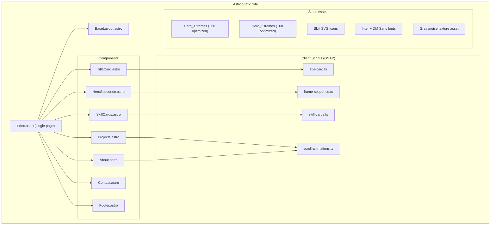

# Portfolio Website — Implementation Plan

## Goal

Build a cinematic, scroll-driven portfolio for **Kritagya Kafle** — a graphic designer transitioning into frontend development. The site opens with a dramatic title-card reveal, then tells the transition story through two pre-shot image sequences (Hero_1: laptop orbit, Hero_2: studio lighting transition), floating skill cards that react to a moving light source, and additional full-portfolio sections (Projects, About, Contact, Footer). Built with **Astro** (static) and **GSAP ScrollTrigger** for all scroll-linked animation.

> [!IMPORTANT]
> **Core Narrative**: The scroll experience IS the portfolio. No navigation bar. The visitor opens on a held-dark title-card moment, then scrolls through a single continuous cinematic sequence that communicates the career transition from Graphic Design → Frontend Development through lighting, motion, and visual metaphor.

---

## User Review Required

> [!IMPORTANT]
> **Frame Optimization Strategy**: Your 480 total frames (~16MB) need to be trimmed for performance. I'll select ~60 key frames per sequence (120 total) that maintain smooth visual continuity — enough density to feel fluid, few enough to load fast. The frames will be compressed and served as optimized WebP via Astro's image pipeline. You asked to "keep smooth transition mustn't seem skipping frames just include mains" — I'll ensure frame spacing is even and the interpolation via `scrub` smoothing masks any gaps.

> [!TIP]
> **Caveman Mode Active**: Implementation will use caveman-style token optimization — compressed responses, zero filler, code stays clean. Same quality, ~65% fewer output tokens.

> [!NOTE]
> **Placeholder Content**: Projects, About, and Contact sections will be built with placeholder structure — you can fill in real content later. Contact will use `mailto:` + social icon slots.

---

## Architecture Overview



---

## Design Token System

Refined direction: **clean grey shades with texture**, not flat color. Every scene carries a subtle grain/noise layer so grey reads as cinematic material (concrete, brushed metal, unlit film stock) rather than a flat hex fill.

| Token | Value | Usage |
|-------|-------|-------|
| `--bg` | `#E8E8E6` | Page background (Scenes 1–2), slightly warm grey |
| `--card-bg` | `#F0F0EE` | Skill card fill |
| `--border` | `#D4D4D1` | Card borders |
| `--text` | `#161616` | Primary text |
| `--text-secondary` | `#5C5C5A` | Subtitle, captions |
| `--glow` | `rgba(255,255,255,0.35)` | Warm white light source |
| `--dark-bg` | `#0D0D0D` | Dark scenes (Title Card, 3–4) background |
| `--grain-opacity-light` | `0.03–0.04` | Noise overlay strength on light scenes |
| `--grain-opacity-dark` | `0.05–0.06` | Noise overlay strength on dark scenes, very slow animated drift |
| `--peacock-accent` | `teal/gold/violet, low saturation` | Brief iridescent tint used only in the title-card burst — never persists into the rest of the palette |

**Grain/texture implementation**: a full-viewport `<canvas>` or tiled SVG `feTurbulence` filter, fixed position, `mix-blend-mode: overlay`, sits above every scene at all times. Kept subtle — texture, not noise-as-decoration.

**Typography**: 
- Display: **DM Sans** (700, 500) — clean geometric, not the AI-default serif
- Body: **Inter** (400, 500) — optimized for screens
- Both from Google Fonts, loaded via `<link>` preconnect

**Motion Rules** (from guide.md):
- Easing: `power2.out` or `power3.inOut` for all scroll-driven scenes — never bounce, never overshoot
- **Exception — Title Card only**: hard, fast easing (`power4.out`) and hard cuts instead of fades. Deliberately contrasts with the slow cinematic rule everywhere else.
- Speed: Very slow, cinematic (outside the title card)
- GSAP scrub uses `ease: 'none'` (per skill critical rules)
- `prefers-reduced-motion` respected globally — title card skips the burst/flash and cuts straight to its settled state

---

## Proposed Changes

### Project Setup

#### [NEW] `astro.config.mjs`

Initialize Astro project with minimal config:

```js
import { defineConfig } from 'astro/config';

export default defineConfig({
  site: 'https://kritagyakafle.com', // placeholder
  vite: {
    css: {
      preprocessorOptions: {}
    }
  }
});
```

**Setup commands:**
```bash
# Initialize Astro in current directory
npx -y create-astro@latest ./ --template minimal --no-install --typescript strict
npm install
npm install gsap
```

#### [NEW] `tsconfig.json`
Standard Astro TypeScript config with `strict` mode.

#### [NEW] `package.json`
Dependencies: `astro`, `gsap`. No other runtime deps — keeping it minimal per CLAUDE.md.

---

### Core Layout

#### [NEW] `src/layouts/BaseLayout.astro`

Single layout wrapping the entire page, with the grain texture layer mounted globally:

```astro
---
interface Props {
  title: string;
  description: string;
}
const { title, description } = Astro.props;
---
<!DOCTYPE html>
<html lang="en">
<head>
  <meta charset="UTF-8" />
  <meta name="viewport" content="width=device-width, initial-scale=1.0" />
  <meta name="description" content={description} />
  <title>{title}</title>
  
  <!-- Fonts -->
  <link rel="preconnect" href="https://fonts.googleapis.com" />
  <link rel="preconnect" href="https://fonts.gstatic.com" crossorigin />
  <link href="https://fonts.googleapis.com/css2?family=DM+Sans:wght@500;700&family=Inter:wght@400;500&display=swap" rel="stylesheet" />
  
  <!-- Global styles -->
  <link rel="stylesheet" href="/src/styles/global.css" />
</head>
<body>
  <div class="grain-overlay" aria-hidden="true"></div>
  <slot />
</body>
</html>
```

---

### Styles

#### [NEW] `src/styles/global.css`

Design system root, resets, grain texture, and shared utilities:

```css
:root {
  --bg: #E8E8E6;
  --card-bg: #F0F0EE;
  --border: #D4D4D1;
  --text: #161616;
  --text-secondary: #5C5C5A;
  --glow: rgba(255, 255, 255, 0.35);
  --dark-bg: #0D0D0D;
  --grain-opacity-light: 0.035;
  --grain-opacity-dark: 0.055;
  
  --font-display: 'DM Sans', sans-serif;
  --font-body: 'Inter', sans-serif;
  
  --ease-smooth: cubic-bezier(0.22, 1, 0.36, 1);
  --ease-hard: cubic-bezier(0.65, 0, 0.35, 1); /* title card only */
}

@media (prefers-reduced-motion: reduce) {
  *, *::before, *::after {
    animation-duration: 0.01ms !important;
    transition-duration: 0.01ms !important;
  }
}

/* Reset + base */
*, *::before, *::after { box-sizing: border-box; margin: 0; padding: 0; }
html { scroll-behavior: auto; /* GSAP handles scrolling */ }
body {
  font-family: var(--font-body);
  color: var(--text);
  background: var(--bg);
  -webkit-font-smoothing: antialiased;
  position: relative;
}

/* Grain overlay — sits above every scene, subtle texture not decoration */
.grain-overlay {
  position: fixed;
  inset: 0;
  z-index: 999;
  pointer-events: none;
  mix-blend-mode: overlay;
  opacity: var(--grain-opacity-light);
  background-image: url("/textures/grain.svg");
  background-size: 220px 220px;
}
body.on-dark-scene .grain-overlay {
  opacity: var(--grain-opacity-dark);
}
```

---

### Scene Components

The scroll experience opens with a title-card scene, then continues through the pinned cinematic sections, each corresponding to a scene from your guide.

#### [NEW] `src/components/TitleCard.astro`

**Scene 0**: The opening reveal, inspired by the *Leo* (2023) title-card sequence — a held dark beat, a hard-lit reveal, and a radiating "peacock" burst before the name snaps in.

```
┌─────────────────────────────────────────────┐
│  <section class="title-card">               │
│    Beat 1 (0.5–1s): near-black hold, grain   │
│    visible, nothing else moving              │
│                                               │
│    Beat 2: hard directional light sweep      │
│    resolves a silhouette/form from shadow    │
│                                               │
│    Beat 3: peacock burst — 12–20 thin rays   │
│    radiate from one point, staggered 0.01–   │
│    0.02s apart, brief teal/gold/violet tint  │
│    that desaturates back to grey as it fades │
│                                               │
│    Beat 4: title text hard-snaps in,         │
│    built from layered kinetic type (below)   │
│    — power4.out, one confident motion        │
│                                               │
│    Beat 5: settle into calm grey Scene 1     │
│  height: 100vh, not pinned — plays once on   │
│  load, then scroll continues into Hero       │
└─────────────────────────────────────────────┘
```

**Peacock burst — implementation notes**:
- SVG rays drawn as thin triangles/lines radiating from a center point
- Each ray's `scale`/`opacity` animated outward with a tiny stagger so the burst reads as one fluid motion, not a mechanical fan
- Burst duration ~0.4–0.6s total
- Color hit is a flash, not a persistent palette shift — always resolves back to `--dark-bg` grey/grain

**Title typography — full creative treatment (not a plain type-on)**:

The name/title isn't a single static line snapping in — it's built from layered, kinetic type that carries the same cinematic weight as the burst:

- **Split-letter reveal**: each character in "KRITAGYA KAFLE" is its own DOM/SVG node, masked and revealed with a per-letter stagger (`0.015–0.03s` apart) riding the same `power4.out` — reads as one gesture, not a typewriter effect
- **Duplicate ghost layer**: a second copy of the text sits slightly offset (2–4px, low opacity, `mix-blend-mode: difference` or `screen`) behind the main text and settles into alignment a beat after the primary layer lands — a subtle chromatic/print-misregistration feel rather than a flat single-pass reveal
- **Weight/scale punch**: letters land slightly oversized (`scale: 1.08 → 1`) at a heavier variable-font weight than their resting state, settling down in the same motion — a felt "impact" rather than a fade
- **Outlined variant during the burst**: the title can briefly render as outline/stroke-only (`-webkit-text-stroke`, fill transparent) so the burst rays show through the letterforms, then fills solid as the burst fades — ties the type directly to the light effect instead of sitting flatly on top of it
- **Subtitle as a separate, slower beat**: "Graphics Meets Development" enters ~0.3–0.4s after the name settles, smaller, `text-transform: uppercase`, wide letter-spacing (`0.15–0.2em`), fading up rather than snapping — hierarchy between the "impact" name and the "explanation" subtitle
- Keep the type itself grey/near-white ink (`--text` on dark) — the peacock color lives in the burst, not the letterforms, so the payoff stays a flash rather than a decorated logotype

This split-letter + ghost-layer system should carry into the Hero section's overlay text too, so the opening beat and Hero don't read as two different type treatments.

---

#### [NEW] `src/components/HeroSequence.astro`

**Scene 1 + Scene 2**: Hero text + scroll-driven frame sequence.

This component renders:
1. A `<canvas>` element (fullscreen, fixed during pin) that draws the current frame
2. Hero typography overlay ("Kritagya Kafle" / "Graphics Meets Development")
3. The subtitle text

**How the frame sequence works:**

```
┌─────────────────────────────────────────────┐
│  <section class="hero-sequence">            │
│    ┌───────────────────────────────────┐     │
│    │  <canvas> (draws current frame)   │     │
│    │  Full viewport, object-fit cover  │     │
│    └───────────────────────────────────┘     │
│    ┌───────────────────────────────────┐     │
│    │  Hero Text Overlay               │     │
│    │  "Kritagya Kafle"                 │     │
│    │  "Graphics Meets Development"     │     │
│    │  subtitle...                      │     │
│    └───────────────────────────────────┘     │
│  height: 500vh (scrollable area for pin)    │
│  GSAP pins this, scrubs frame index 0→59   │
└─────────────────────────────────────────────┘
```

**Hero typography — carries the Title Card's creative system forward, not a plain static caption:**

- Same split-letter + ghost-layer setup as the title card (see TitleCard.astro), but scrub-linked instead of timeline-driven: as the frame sequence advances, letters can shift 1–2px of parallax relative to the canvas behind them, so the type feels like it's floating in the same depth as the orbit shot rather than pasted flat on top
- Name stays the "impact" weight/scale treatment from the title card; subtitle keeps its slower, wide-tracking uppercase entrance
- As Scene 2 progresses toward the seamless cut into Scene 3, the hero text exits with the *inverse* of its entrance (ghost layer separates back out, letters scale down slightly) rather than a plain fade — keeps the kinetic-type language consistent instead of reverting to a generic opacity transition
- Text color/weight responds to the frame sequence's own lighting where practical (e.g. slightly higher weight/contrast during brighter frames) so it doesn't read as a static overlay sitting independently of the cinematography

**Frame Selection Strategy** (~60 frames per sequence from 240 originals):
- Take every 4th frame: 001, 005, 009, ... 237, 240
- This gives 60 frames — enough for smooth 60fps-like scrubbing
- GSAP `scrub: 0.5` adds a slight lag that smooths visual transitions between frames
- Frames will be converted to WebP and moved to `public/frames/hero-1/` and `public/frames/hero-2/`

**Canvas rendering approach** (Apple.com technique):
```js
// Pseudocode — actual implementation in frame-sequence.ts
const canvas = document.querySelector('canvas');
const ctx = canvas.getContext('2d');
const images = []; // preloaded Image objects
let currentFrame = { value: 0 };

// GSAP scrubs currentFrame.value from 0 to frameCount-1
gsap.to(currentFrame, {
  value: frameCount - 1,
  ease: 'none',
  snap: { value: 1 }, // snap to integer frame indices
  scrollTrigger: {
    trigger: '.hero-sequence',
    pin: true,
    scrub: 0.5,
    start: 'top top',
    end: '+=400%', // 4x viewport of scroll distance
  },
  onUpdate: () => {
    const idx = Math.round(currentFrame.value);
    ctx.clearRect(0, 0, canvas.width, canvas.height);
    ctx.drawImage(images[idx], 0, 0, canvas.width, canvas.height);
  }
});
```

---

#### [NEW] `src/components/SkillCards.astro`

**Scene 3 + Scene 4**: Floating skill cards with light-reactive behavior.

This component covers the second frame sequence (Hero_2) where the light source moves from left → right, transitioning from Graphic Design skills to Development skills.

**Structure:**

```
┌──────────────────────────────────────────────────┐
│  <section class="skills-scene">                  │
│    ┌──────────────────────────────────┐           │
│    │  <canvas> (Hero_2 frame seq)    │           │
│    └──────────────────────────────────┘           │
│    ┌──────────────────────────────────┐           │
│    │  Design Skills (left cluster)    │           │
│    │  ┌─────────┐ ┌─────────┐        │           │
│    │  │ PS icon │ │ Figma   │        │           │
│    │  │ + label │ │ + label │        │           │
│    │  └─────────┘ └─────────┘        │           │
│    │  ... (8 design skills)           │           │
│    └──────────────────────────────────┘           │
│    ┌──────────────────────────────────┐           │
│    │  Dev Skills (right cluster)      │           │
│    │  ┌─────────┐ ┌─────────┐        │           │
│    │  │ Astro   │ │ React   │        │           │
│    │  │ + icon  │ │ + icon  │        │           │
│    │  └─────────┘ └─────────┘        │           │
│    │  ... (10 dev skills)             │           │
│    └──────────────────────────────────┘           │
│  height: 600vh (long pin for light transition)   │
└──────────────────────────────────────────────────┘
```

**Skill Card Design:**

```css
.skill-card {
  display: inline-flex;
  align-items: center;
  gap: 8px;
  padding: 10px 18px;
  background: var(--card-bg);
  border: 1px solid var(--border);
  border-radius: 12px;
  font-family: var(--font-body);
  font-size: 14px;
  font-weight: 500;
  color: var(--text);
  opacity: 0.9;
  box-shadow: 0 2px 8px rgba(0, 0, 0, 0.04);
  backdrop-filter: blur(8px);
  transition: opacity 0.6s var(--ease-smooth);
}

.skill-card svg {
  width: 20px;
  height: 20px;
}
```

**Light-Reactive Animation** (the enhancement from guide.md):
- A virtual "light position" is scrubbed from 0 (left) to 1 (right) via scroll
- Each skill card's opacity/brightness is calculated based on its distance from the light
- Cards closer to the light brighten; cards further fade
- As light reaches right side: design cards dissolve, dev cards illuminate

```js
// Pseudocode for light-reactive cards
const lightPos = { x: 0 }; // 0 = full left, 1 = full right

gsap.to(lightPos, {
  x: 1,
  ease: 'none',
  scrollTrigger: {
    trigger: '.skills-scene',
    pin: true,
    scrub: 0.5,
    start: 'top top',
    end: '+=500%',
  },
  onUpdate: () => {
    designCards.forEach(card => {
      const dist = Math.abs(card.normalizedX - lightPos.x);
      card.style.opacity = Math.max(0, 1 - dist * 1.5);
      card.style.filter = `brightness(${1 + (1 - dist) * 0.3})`;
    });
    devCards.forEach(card => {
      const dist = Math.abs(card.normalizedX - lightPos.x);
      card.style.opacity = Math.max(0, 1 - dist * 1.5);
      card.style.filter = `brightness(${1 + (1 - dist) * 0.3})`;
    });
  }
});
```

**Skill Cards Data:**

| Design Skills | Dev Skills |
|---------------|------------|
| Adobe Photoshop | Astro |
| Figma | React |
| Illustrator | Next.js |
| After Effects | TypeScript |
| Premiere Pro | Tailwind CSS |
| Brand Identity | GSAP |
| UI Design | Framer Motion |
| Motion Graphics | Node.js |
| | Git |
| | REST APIs |

Each card will have an inline SVG icon sourced from [Simple Icons](https://simpleicons.org/) or brand SVGs.

---

### Post-Cinematic Sections

After the cinematic experience (Title Card + Scenes 1–4), the page transitions into a clean, static-feeling layout for the remaining portfolio sections. This transition is intentional — the cinematic part sells the narrative; the remaining sections provide utility.

#### [NEW] `src/components/TransitionBridge.astro`

A visual bridge between the dark cinematic scenes and the portfolio sections:
- Gradient from `var(--dark-bg)` → `var(--bg)`
- A single centered line: **"See what I've built."**
- Subtle fade-in on scroll entry

---

#### [NEW] `src/components/Projects.astro`

**Layout**: Clean grid of project cards (2 columns on desktop, 1 on mobile).

Each project card:
```
┌──────────────────────────────┐
│  ┌────────────────────────┐  │
│  │  Project Screenshot    │  │
│  │  (aspect-ratio 16/10)  │  │
│  └────────────────────────┘  │
│  Project Title               │
│  Short description...        │
│  ┌──────┐ ┌──────┐ ┌──────┐ │
│  │ Astro│ │ GSAP │ │ CSS  │ │
│  └──────┘ └──────┘ └──────┘ │
│  [View Live] [GitHub]        │
└──────────────────────────────┘
```

- Cards use `var(--card-bg)` background with `var(--border)` 
- Subtle `scale(1.02)` hover with `var(--ease-smooth)` transition
- Fade-in-up on scroll entry using `gsap.from` + ScrollTrigger (`stagger: 0.15`)
- Tech tags styled as small pills

---

#### [NEW] `src/components/About.astro`

**Layout**: Two-column on desktop (text | visual), stacked on mobile.

Left column:
- Short heading: "About"
- 2–3 paragraphs about the design→dev transition
- Clean, readable at `18px/1.7` line-height

Right column:
- A still image or the final Hero_2 frame (close-up with right-side lighting)
- Rounded corners, subtle shadow

Scroll animation: text slides in from left, image from right — both with `power2.out`, `stagger: 0.2`.

---

#### [NEW] `src/components/Contact.astro`

**Layout**: Centered, minimal.

```
┌────────────────────────────────────┐
│         Let's work together.       │
│                                    │
│  A sentence about being open to    │
│  freelance or collaboration.       │
│                                    │
│  ┌──────────────────────────────┐  │
│  │  hello@kritagyakafle.com     │  │
│  └──────────────────────────────┘  │
│                                    │
│  [GitHub] [LinkedIn] [Dribbble]    │
└────────────────────────────────────┘
```

- Email rendered as a styled `mailto:` link
- Social icons as inline SVGs with hover color transitions
- No contact form (keeps it static, no backend needed)

---

#### [NEW] `src/components/Footer.astro`

Minimal footer:
```
─────────────────────────────────────
  © 2026 Kritagya Kafle
  Built with Astro + GSAP
─────────────────────────────────────
```

- `var(--text-secondary)` color, `14px` size
- Centered, with generous padding

---

### Client-Side Scripts

#### [NEW] `src/scripts/title-card.ts`

Drives the opening title-card sequence:

1. **Timeline** (GSAP, non-scrubbed — plays once on load): hold → light sweep → peacock burst → text snap → settle
2. **Peacock burst**: generates 12–20 SVG rays at runtime, animates `scale`/`opacity` outward with a tiny (`0.01–0.02s`) stagger per ray
3. **Kinetic text snap-in**: per-letter split reveal + duplicate ghost layer + weight/scale punch (see typography treatment above), using `--ease-hard` (`power4.out`), one confident motion, no bounce/overshoot
4. Adds `on-dark-scene` class to `<body>` while this scene is active (drives grain opacity)
5. Respects `prefers-reduced-motion`: skips hold/sweep/burst, renders the settled end-state immediately

---

#### [NEW] `src/scripts/frame-sequence.ts`

The core engine for scroll-driven frame playback:

1. **Preloads** all frames for both sequences into `Image` objects
2. **Draws** the current frame on a `<canvas>` element using `drawImage()`
3. **Syncs** the frame index to scroll position via GSAP `scrollTrigger` with `scrub: 0.5`
4. **Handles** canvas resize on window resize (debounced)
5. **Shows** a loading indicator while frames load

Key implementation details:
- Canvas sized to viewport, images drawn with `object-fit: cover` logic
- `snap: { value: 1 }` ensures frame index lands on whole numbers
- Hero_1 and Hero_2 are treated as separate pinned ScrollTrigger instances
- The last frame of Hero_1 = first frame of Hero_2 (seamless transition per guide.md)

**Progressive Loading:**
- Load frames 1–10 immediately (for above-fold)
- Load remaining frames via `requestIdleCallback` or after initial paint
- Show a subtle progress bar during load if needed

---

#### [NEW] `src/scripts/skill-cards.ts`

Handles the floating skill card animations:

1. **Entry**: Cards appear one-by-one with stagger (opacity 0→0.9, y: 20→0)
2. **Light tracking**: Virtual light position (0→1) drives card brightness/opacity
3. **Drift**: Subtle CSS-driven slow drift on cards (translateY oscillation via CSS `@keyframes`)
4. **Exit**: Design cards fade as light passes right; dev cards illuminate

---

#### [NEW] `src/scripts/scroll-animations.ts`

General scroll-triggered animations for the post-cinematic sections:

- Projects: `gsap.from('.project-card', { opacity: 0, y: 60, stagger: 0.15 })`
- About: text slides in from left, image from right
- Contact: simple fade-in
- All using `start: 'top 85%'` trigger point
- All respecting `prefers-reduced-motion`

---

### Frame Optimization Pipeline

#### [NEW] `scripts/optimize-frames.sh`

A build-time script to prepare frames:

```bash
#!/bin/bash
# Select every 4th frame and convert to WebP
# Requires: cwebp (from libwebp) or sharp-cli

SRC_DIR="Hero_1"
DEST_DIR="public/frames/hero-1"
mkdir -p "$DEST_DIR"

for i in $(seq -w 1 4 240); do
  cwebp -q 80 -resize 1920 0 "$SRC_DIR/ezgif-frame-$i.jpg" -o "$DEST_DIR/frame-$(printf '%03d' $((($i-1)/4))).webp"
done

# Same for Hero_2
SRC_DIR="Hero_2"
DEST_DIR="public/frames/hero-2"
mkdir -p "$DEST_DIR"

for i in $(seq -w 1 4 240); do
  cwebp -q 80 -resize 1920 0 "$SRC_DIR/ezgif-frame-$i.jpg" -o "$DEST_DIR/frame-$(printf '%03d' $((($i-1)/4))).webp"
done
```

This reduces:
- **Hero_1**: 240 JPGs (~7.2MB) → 60 WebPs (~2.5MB estimated)
- **Hero_2**: 240 JPGs (~9.1MB) → 60 WebPs (~3.5MB estimated)
- **Total**: ~16MB → ~6MB (62% reduction)

---

### SVG Icons & Textures

#### [NEW] `src/assets/icons/`

Inline SVG icons for each skill, sourced from Simple Icons brand guidelines:

| File | Brand |
|------|-------|
| `photoshop.svg` | Adobe Photoshop |
| `figma.svg` | Figma |
| `illustrator.svg` | Adobe Illustrator |
| `aftereffects.svg` | After Effects |
| `premierepro.svg` | Premiere Pro |
| `astro.svg` | Astro |
| `react.svg` | React |
| `nextjs.svg` | Next.js |
| `typescript.svg` | TypeScript |
| `tailwindcss.svg` | Tailwind CSS |
| `gsap.svg` | GSAP |
| `framermotion.svg` | Framer Motion |
| `nodejs.svg` | Node.js |
| `git.svg` | Git |

For "Brand Identity", "UI Design", "Motion Graphics", and "REST APIs" — custom minimal icons.

#### [NEW] `public/textures/grain.svg`

A tileable `feTurbulence`-based noise SVG used as the global grain overlay (see global.css `.grain-overlay`). Kept as a static tile rather than per-frame canvas noise for performance.

---

## Scroll Timeline Summary

```mermaid
graph LR
    S0["Title Card<br/>Held dark → light sweep<br/>Peacock burst → name snap"]
    S1["Scene 1: Hero<br/>Light grey bg, typography<br/>You at laptop"] 
    S2["Scene 2: Orbit<br/>Frame sequence scrub<br/>Camera orbits 180°"]
    S3["Scene 3: Graphics<br/>Close-up face, dark bg<br/>Light from LEFT<br/>Design skill cards appear"]
    S4["Scene 4: Development<br/>Light moves to RIGHT<br/>Design cards fade<br/>Dev cards illuminate"]
    TB["Transition Bridge<br/>'See what I've built.'"]
    PR["Projects Section"]
    AB["About Section"]
    CO["Contact Section"]
    FT["Footer"]
    
    S0 -->|"settle → scroll"| S1
    S1 -->|scroll| S2
    S2 -->|"seamless (last frame H1 = first frame H2)"| S3
    S3 -->|"light moves L→R"| S4
    S4 -->|"gradient dark→light"| TB
    TB --> PR
    PR --> AB
    AB --> CO
    CO --> FT
```



---

## File Tree (Final)

```
Portfolio/
├── astro.config.mjs
├── tsconfig.json
├── package.json
├── CLAUDE.md                          (existing — untouched)
├── guide.md                           (existing — untouched)
├── Hero_1/                            (existing source frames — untouched)
├── Hero_2/                            (existing source frames — untouched)
├── scripts/
│   └── optimize-frames.sh            (build-time frame optimizer)
├── public/
│   ├── frames/
│   │   ├── hero-1/                    (60 optimized WebP frames)
│   │   └── hero-2/                    (60 optimized WebP frames)
│   ├── textures/
│   │   └── grain.svg                  (global noise/grain tile)
│   └── favicon.svg
├── src/
│   ├── layouts/
│   │   └── BaseLayout.astro
│   ├── pages/
│   │   └── index.astro               (single page, composes all sections)
│   ├── components/
│   │   ├── TitleCard.astro            (Scene 0: peacock-burst reveal)
│   │   ├── HeroSequence.astro         (Scenes 1–2: hero text + frame canvas)
│   │   ├── SkillCards.astro           (Scenes 3–4: light + floating cards)
│   │   ├── TransitionBridge.astro     (dark → light gradient bridge)
│   │   ├── Projects.astro            (project showcase grid)
│   │   ├── About.astro               (about section)
│   │   ├── Contact.astro             (contact + socials)
│   │   └── Footer.astro              (minimal footer)
│   ├── scripts/
│   │   ├── title-card.ts              (title-card timeline + peacock burst)
│   │   ├── frame-sequence.ts          (canvas frame engine + GSAP)
│   │   ├── skill-cards.ts             (light-reactive card animations)
│   │   └── scroll-animations.ts       (general scroll-triggered anims)
│   ├── styles/
│   │   └── global.css                 (design tokens, grain overlay + reset)
│   └── assets/
│       └── icons/                     (SVG brand icons for skills)
└── .agents/                           (existing — untouched)
```

---

## Verification Plan

### Automated Tests

```bash
# TypeScript & Astro validation
npx astro check

# Build succeeds with no errors
npx astro build

# Dev server starts cleanly
npx astro dev
```

### Manual Verification

1. **Title Card Reveal**: On first load, the hold → light sweep → peacock burst → text snap sequence should read as one confident cinematic beat — no lingering eases, no bounce. Burst color should flash and fade back to grey, not persist.

2. **Kinetic Typography**: The name should reveal letter-by-letter with a visible ghost/ghost-offset layer and a felt weight/scale punch — not a flat fade-in or plain type-on. The same system should carry into the Hero overlay text and its exit into Scene 3.

3. **Grain Texture**: Grain should be visible but subtle across every scene, slightly stronger on dark scenes. Should not look like static/noise-as-decoration.

4. **Frame Sequence Smoothness**: Scroll through Scenes 1–2 slowly — frames should transition without visible jumps. `scrub: 0.5` should make it feel buttery.

5. **Seamless Scene Cut**: The transition from Hero_1 (last frame) to Hero_2 (first frame) should be invisible — no flash, no jump.

6. **Light Source Animation**: In Scenes 3–4, the virtual light should move smoothly from left to right. Design cards should brighten on the left, then fade as light passes. Dev cards should illuminate as light reaches the right.

7. **Skill Card Appearance**: Cards should appear one-by-one (not all at once), with subtle drift animation. No bouncing, no overshooting.

8. **Reduced Motion**: Test with `prefers-reduced-motion: reduce` enabled — title card skips straight to its settled state, all other animations instant/disabled, content still fully accessible.

9. **Mobile Responsiveness**: Test at 375px width — layouts should stack, text should remain readable, frame sequence should still work.

10. **Performance**: Lighthouse audit targeting 90+ Performance score. Frame loading and grain overlay should not block initial paint.

10. **Post-Cinematic Sections**: Projects, About, Contact, Footer should render cleanly with subtle scroll-entry animations.
