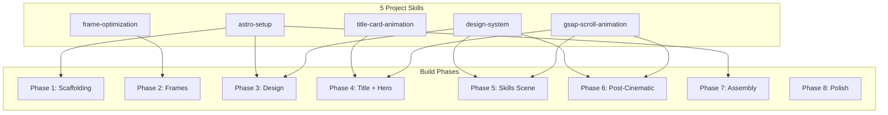

# Skills Registry

Index of all project-specific skills. Each skill lives in `.agents/skills/<name>/SKILL.md` and is loaded on demand when its domain is relevant.

---

## Skill Map

---

## 1. `astro-setup`

| | |
|---|---|
| **Path** | [.agents/skills/astro-setup/SKILL.md](.agents/skills/astro-setup/SKILL.md) |
| **When to call** | Initializing the project, creating Astro components/layouts/pages, configuring `astro.config.mjs`, importing client scripts, handling static assets |
| **Covers** | `create-astro` CLI flags, frontmatter patterns, `<script>` client-side bundling, `public/` vs `src/assets/` rules, Google Fonts loading, TypeScript strict mode |
| **Used in phases** | 1 (Scaffolding), 3 (Design Foundation), 7 (Assembly) |

**Key rules from this skill:**
- Static output only — no SSR, no `output: 'server'`
- GSAP runs client-side via `<script>` tags in `.astro` files
- Fonts loaded via `<link>` preconnect in layout head
- `public/` files served at root path, no processing

---

## 2. `gsap-scroll-animation`

| | |
|---|---|
| **Path** | [.agents/skills/gsap-scroll-animation/SKILL.md](.agents/skills/gsap-scroll-animation/SKILL.md) |
| **When to call** | Any scroll-driven animation, ScrollTrigger pinning, canvas frame sequences, stagger animations, or motion design decisions |
| **Covers** | `scrub` easing rule (`ease: 'none'`), pin patterns, canvas `drawImage` cover-fit, frame preloading, `prefers-reduced-motion`, easing table |
| **Used in phases** | 4 (Title + Hero), 5 (Skills Scene), 6 (Post-Cinematic) |

**Key rules from this skill:**
- **CRITICAL**: Scrub tweens MUST use `ease: 'none'` — the scrub mechanism provides smoothing
- General: `power2.out` or `power3.inOut` — cinematic, no bounce
- Title Card only: `power4.out` — hard, fast, confident
- **NEVER**: `bounce`, `elastic`, `back` easing
- Always check `prefers-reduced-motion` before animating
- Canvas frame engine uses Apple.com technique: preload → `drawImage` → `snap: { value: 1 }`

---

## 3. `frame-optimization`

| | |
|---|---|
| **Path** | [.agents/skills/frame-optimization/SKILL.md](.agents/skills/frame-optimization/SKILL.md) |
| **When to call** | Selecting frames from Hero_1/Hero_2, deduplicating, converting to WebP, or handling the dark-bridge transition |
| **Covers** | Duplicate detection (identical file sizes), sampling strategy, `sharp` WebP conversion (not `cwebp` — not installed), transition bridge logic |
| **Used in phases** | 2 (Frame Pipeline) |

**Key rules from this skill:**
- ~48 duplicate pairs per sequence at regular intervals — skip by comparing consecutive file sizes
- Target: ~60 unique frames per sequence from ~192 unique source frames
- Use `sharp` npm package (not `cwebp`) — `sharp(input).resize(1920).webp({ quality: 80 })`
- Output to `public/frames/hero-1/` and `public/frames/hero-2/`
- Hero_1 → Hero_2 transition works via shared dark frames (near-black ~frame 154), NOT identical frames

---

## 4. `design-system`

| | |
|---|---|
| **Path** | [.agents/skills/design-system/SKILL.md](.agents/skills/design-system/SKILL.md) |
| **When to call** | Setting colors, typography, grain texture, card styles, responsive breakpoints, or any visual design decision |
| **Covers** | 9 CSS custom properties, DM Sans + Inter typography, grain overlay (SVG feTurbulence, `mix-blend-mode: overlay`), skill card styling, easing CSS variables |
| **Used in phases** | 3 (Design Foundation), 5 (Skills Scene), 6 (Post-Cinematic), 7 (Assembly) |

**Key rules from this skill:**
- Palette is grey with depth — 9 light tokens + 5 dark tokens + 4 special tokens
- Dark scene cards use `--dark-surface` / `--dark-border` / `--dark-text` — NOT light card styles
- Peacock accent exact values: teal `#3D8B8B`, gold `#B8943D`, violet `#7A5BA0` — low saturation (39-50%)
- Peacock colors desaturate to `#3A3A3A` (warm dark grey) during burst fade — never persist
- Grain: fixed SVG tile, `mix-blend-mode: overlay`, with slow animated drift (8s cycle) on dark scenes
- Section background map defines exact bg/text/grain for every section — no guessing
- Typography: DM Sans for display (500/700), Inter for body (400/500) — both Google Fonts
- Responsive: test at 375px width minimum

---

## 5. `title-card-animation`

| | |
|---|---|
| **Path** | [.agents/skills/title-card-animation/SKILL.md](.agents/skills/title-card-animation/SKILL.md) |
| **When to call** | Building the opening cinematic sequence, peacock burst SVG rays, split-letter typography, or ghost-layer effects |
| **Covers** | 5-beat timeline (hold → sweep → burst → text snap → settle), ray generation, per-character DOM splitting, ghost offset layer, outline-during-burst trick |
| **Used in phases** | 4 (Title Card + Hero) |

**Key rules from this skill:**
- Plays ONCE on load — NOT scroll-driven. Total duration ~3.5s
- Full timeline: 0.8s dark hold → 0.6s sweep → 0.5s burst → 0.8s text → 0.3s gap → 0.6s subtitle → 0.4s settle
- `power4.out` easing for everything except subtitle (uses softer `power2.out` for hierarchy contrast)
- Peacock burst: 16 SVG rays, colors alternate teal/gold/teal/violet pattern
- Ghost layer uses `mix-blend-mode: screen` (DECIDED — not `difference`). Opacity: 0.15 max.
- Letters stagger ≤0.02s — must read as "one gesture with texture," not typewriter
- Burst SVG elements must be destroyed after animation — never leak into next scene
- `prefers-reduced-motion`: skip all 5 beats, show settled end-state immediately

---

## Skill Interconnections

| Skill A | Depends On | How |
|---------|-----------|-----|
| `title-card-animation` | `design-system` | Uses `--dark-bg`, `--peacock-accent`, `--font-display`, grain opacity class |
| `title-card-animation` | `gsap-scroll-animation` | Uses GSAP timeline (but NOT scrub — timeline plays once) |
| `gsap-scroll-animation` | `frame-optimization` | Consumes the optimized WebP frames from `public/frames/` |
| `gsap-scroll-animation` | `design-system` | Uses easing CSS variables, card styles, reduced-motion rules |
| `frame-optimization` | `astro-setup` | Output goes to `public/` directory (Astro's static asset convention) |
| `astro-setup` | `design-system` | Layout imports `global.css` which defines all tokens |
